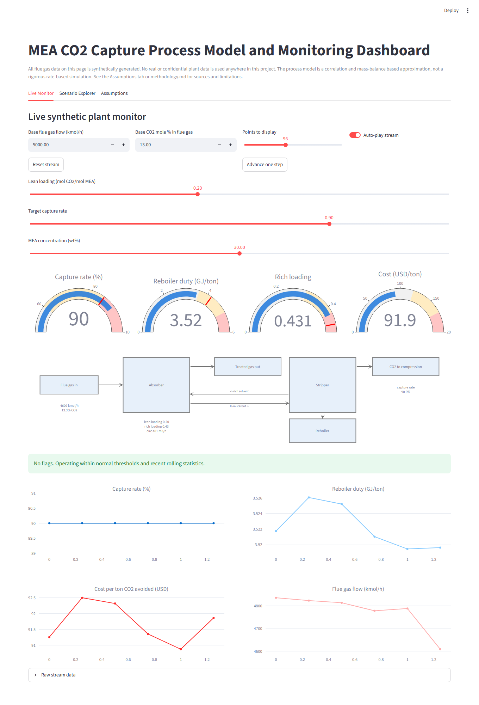
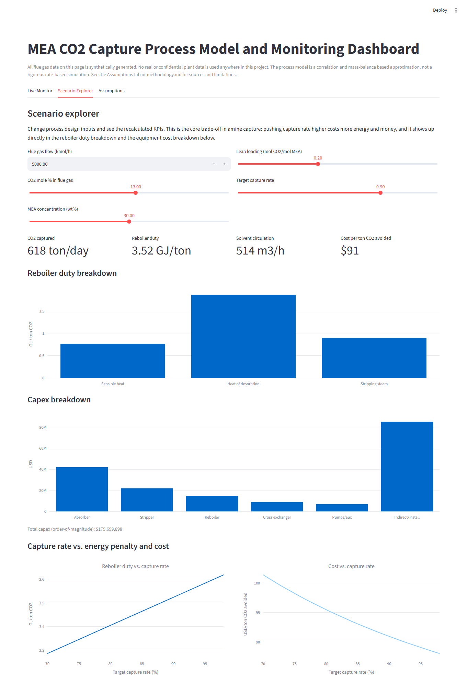
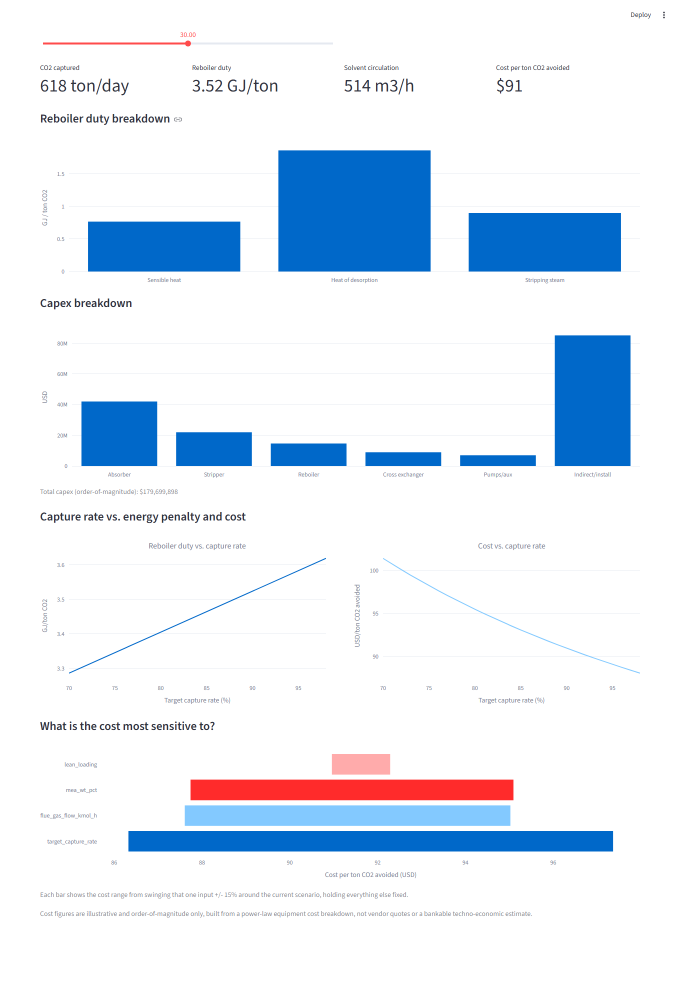

# CO2 Capture Process Model + Monitoring Dashboard

A Python project that models a simplified amine (MEA) CO2 capture unit and
shows the results on a live monitoring dashboard, like a stripped down
version of what a plant monitoring screen might actually look like.

I built this to dig into the process engineering side of carbon capture
(mostly for a CCUS-related internship application) without needing access to
Aspen Plus or any real plant data. Everything here is open source Python and
everything on the dashboard is synthetic data, there is no real plant or
proprietary information involved anywhere.

## What it actually does

There's a process model for a 30 wt% MEA absorber/stripper loop. You give it
a flue gas flow rate, CO2 percentage, amine concentration, lean loading, and
a target capture rate. It solves for the rich loading using a simplified
Kent-Eisenberg style vapor-liquid equilibrium relation instead of assuming a
fixed number, then backs out solvent circulation from a mass balance, and
builds up reboiler duty from its three real physical components (sensible
heat, heat of desorption, stripping steam) instead of one lumped
correlation.

On top of that there's a techno-economics module that breaks capex into
actual equipment line items (absorber, stripper, reboiler, cross exchanger,
pumps) scaled with standard power-law cost exponents, rolls that up into a
rough $/ton CO2 avoided figure, and can run a tornado-style sensitivity to
show which input the cost actually moves the most with. A synthetic data
generator fakes a fluctuating flue gas feed over a 24 hour load curve,
complete with occasional upset events (a CO2 slug or a flow surge), so the
dashboard has something real to react to instead of a flat line.

The dashboard is Streamlit, it has three tabs:

- **Live Monitor**: auto-plays the synthetic feed, with gauges, a simple
  process schematic, rolling KPI trends, and anomaly flags. The flags use a
  rolling z-score check (a basic control-chart rule) plus a couple of static
  guardrails, not machine learning.
- **Scenario Explorer**: sliders for amine concentration, capture rate
  target, and flue gas composition, with the reboiler duty breakdown, the
  capex breakdown, the classic capture-rate-vs-cost trade-off curve, and the
  tornado sensitivity chart all updating live.
- **Assumptions**: a short honest summary of what the model is and is not,
  so nobody watching a demo mistakes this for a validated simulator.

## Screenshots

Live Monitor tab, gauges and the process schematic updating as the synthetic
feed advances:



Scenario Explorer tab, reboiler duty and capex broken into their real
components instead of one number:



Same tab scrolled down, capture-rate trade-off curves and the tornado
sensitivity chart:



## Why correlations instead of a real simulator

Building an actual rate-based packed column model is a multi month exercise
and needs proprietary correlations most of the time anyway. Instead I used
published numbers and relationships from open MEA literature, mainly the
Kent-Eisenberg equilibrium framework for CO2 partial pressure over loaded
amine, and the Freeman and Rochelle (UT Austin) breakdown of reboiler duty
into sensible heat, heat of reaction, and stripping steam, and built
simplified but physically reasonable versions of both instead of assuming a
single fixed correlation. Capex uses the same logic: real equipment line
items with real power-law scaling exponents, just with illustrative
reference costs instead of vendor quotes. The full breakdown of what was
used, where the numbers came from, and where the model's known weak points
are is in [methodology.md](methodology.md).

This is still not a bankable techno-economic study and it's not a rigorous
process simulation. It's scoped to be a believable, defensible approximation
that gets the mechanisms and the trends right, not the fourth decimal place.

## Running it

```bash
pip install -r requirements.txt
streamlit run dashboard.py
```

That opens the dashboard in your browser. If you just want to poke at the
model directly:

```python
from co2_capture.process_model import ProcessInputs, run_process_model
from co2_capture.techno_economics import run_techno_economics

inputs = ProcessInputs(flue_gas_flow_kmol_h=5000, co2_mol_pct=13.0)
process_result = run_process_model(inputs)
cost_result = run_techno_economics(process_result)

print(process_result)
print(cost_result)
```

## Running the tests

```bash
pip install pytest
pytest tests/
```

There are 17 tests covering the equilibrium relation's shape (pressure rises
with loading and temperature), the reboiler duty component breakdown, mass
balance consistency, the capex line items summing correctly, and the
tornado sensitivity output, plus a couple of tests on the anomaly detection
logic. They mostly check that the numbers stay in physically sane ranges
and that the trade-offs move in the right direction, rather than checking
exact values, since this is an approximation, not a validated simulator.

A GitHub Actions workflow runs the same test suite on every push.

## Project layout

```
co2_capture/
  process_model.py     Kent-Eisenberg equilibrium + reboiler duty breakdown (Module A)
  techno_economics.py  equipment-level capex, cost per ton, tornado sensitivity (Module B)
  synthetic_plant.py   fake flue gas stream with load curve and upset events (Module C)
  anomaly.py           rolling z-score and static guardrail checks
dashboard.py           Streamlit app, live monitor + scenario explorer (Modules D and E)
tests/                 sanity checks against published ranges and internal consistency
methodology.md         assumptions, sources, and limitations
```

## Limitations, said plainly

- No rigorous stage-by-stage VLE solve or packed column hydraulics. The
  Kent-Eisenberg style relation here is simplified and hand-fitted to a
  couple of qualitative anchors, not fitted to a full published dataset.
- No physical pilot unit and no real plant data anywhere.
- Cost numbers come from power-law scaling off illustrative reference costs,
  not vendor quotes or bottom-up equipment sizing.
- The dashboard's anomaly flags are rolling statistics and static
  thresholds. It is not machine learning and I'm not going to pretend it's
  fault detection or a digital twin.

More detail on assumptions, cited sources, and what I'd build next with more
time is in [methodology.md](methodology.md).
